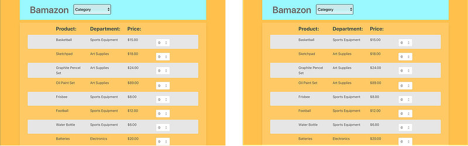

# Bamazon

At first landing an intuitive product listing greets you. A large category button is dynamically generated from the database to help navigate through the growing assortment. All data requests are handle through promise based jQuery requests to prevent page reloads when we need to post inventory issues.

The more astute viewers will notice the tiny management link. Initial page is used to update inventory count and pricing as adjustments are needed. In order to help out our inventory manager we added a link for low stock items to make adjustments quicker. It's also possilbe to adjust the url used to modify the threshold. Lastly is the new products page for updating the database as our product diversity increases

## Technology

- NodeJS with ExpressJS webserver
- jQuery with Bulma for frontend
- MySQL database with Sequelize ORM for getting and managing data

Challenges on this project were in the details. It would have been easy to hardcode a lot of the front end on this, but production code should be more dynamic for ease of extension. Bulma, through NPM install, was a new challenge to work through. Some elements couldn't be adjusted via just css alone - noteably the nav bar. Sequelize is an ongoing challenge coming from basic MySQL queries and often necessitates refering to documentation for both syntax and available methods.

